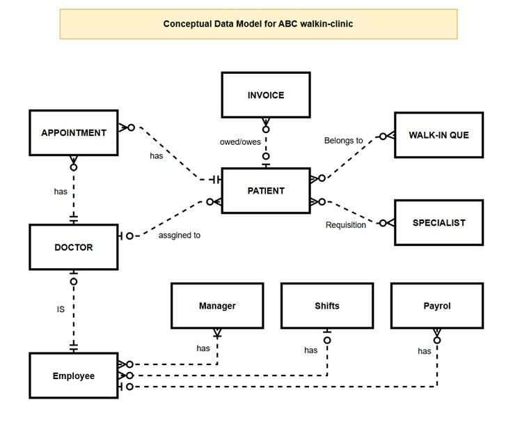

# COMP1168_Group_Project
These are just suggested responsabilities, we can discuss and decide who does what and change accordingly.
DUE DATE: Sunday April 12, 2026 (midnight)
# Responsabilities

# Eric - And any one who wants to help :)
* Conceptual Data Model using Draw.io or similar
https://drive.google.com/file/d/1-sr-7vQvrWCLeB1dwnVRgbKijT_8F3YU/view?usp=sharing

# User 2
* Physical (Logical) Data Mode Using MySql WorkBench

# Zak
* 5 Queries (communicate with other person what quiries you are doing to prevent overlap!)

# User 4
* 5 Other Queries

# User 5
* Project Report
